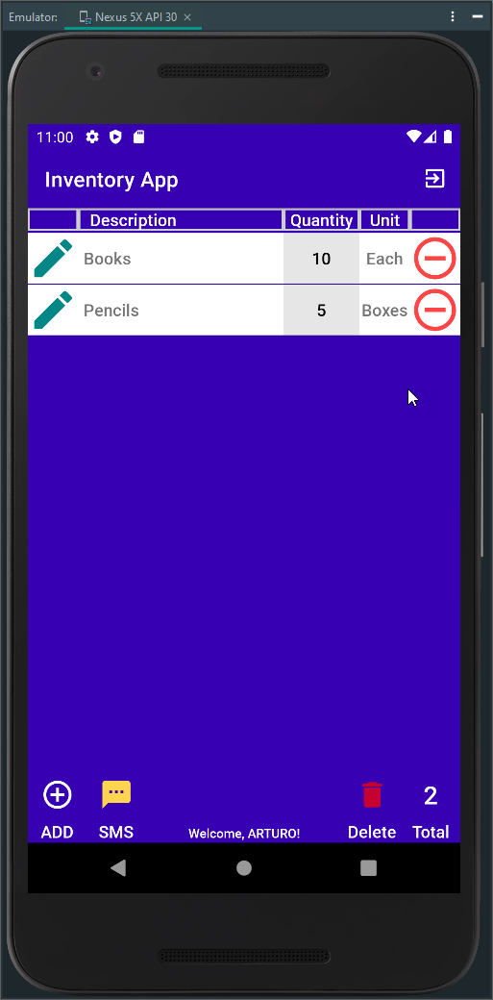

# Inventory App - Android Mobile Application

---

## CS360 Mobile Architect & Programming 21EW6 August 2021

---

    

## Purpose

As a team member of Mobile2App company, we have been hired to assist in developing a mobile application to track items in a warehouse, Inventory App (Option 1). The mobile application project will go through different steps, from planning to design to development, to be ready for launch in the following weeks.

The team takes time to orient themselves to understand the goals and users to target the app. The team meets weekly to discuss the latest client request sent in and assign the work implementing mobile application development principles and best practices in developing a mobile application.

**The Goal:** *The Inventory application is to track items in an inventory list through the primary use of mobile devices. As an example, the track of the items through the app at a warehouse assists in managing and automating the warehouse logistics and accelerating the business's growth and expansion. The app allows the user to fulfill anywhere experience with real-time inventory visibility on any device. The app development is initially based on install for Android Devices.*

To achieve these goal, it has been requested that the mobile application must initially include the following features :

* A database with at least two tables to store: Inventory items, User logins and passwords
* A screen for sign-in or sign-up into the app.
* A grid screen that displays all items in the inventory.
* A mechanism where the user can add and remove items from the inventory.
* A mechanism where the user can increase or decrease the number of specific items in the inventory.
* A mechanism to notify the user when the amount of any item in the inventory has been reduced to zero

## Screenshots

            

### Note

This repo is the refactor and completed final project of the SNHU CS360 Mobile Architect & Programming 21EW6 course. Screenshots varies from final running app.

---

## License

[MIT](LICENSE)

---

_[Last Update September 2021 by ASR]_
