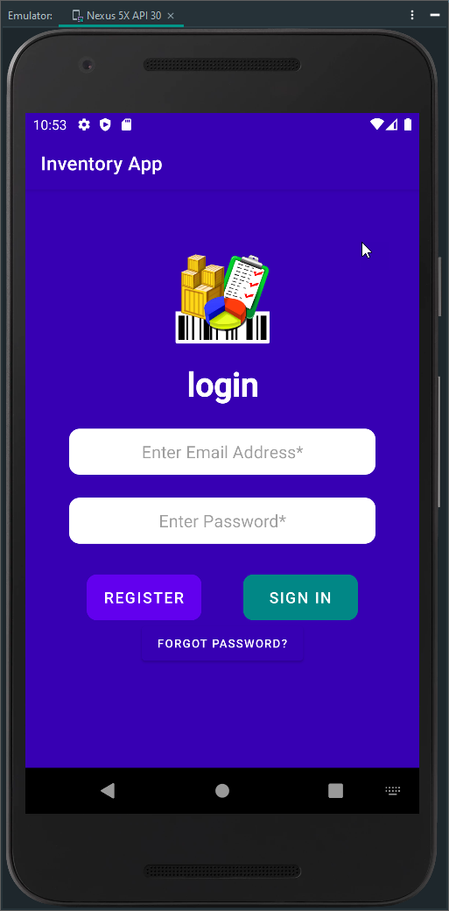
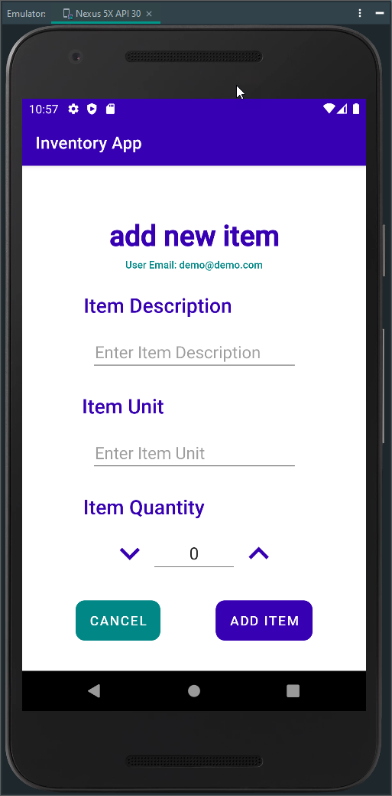
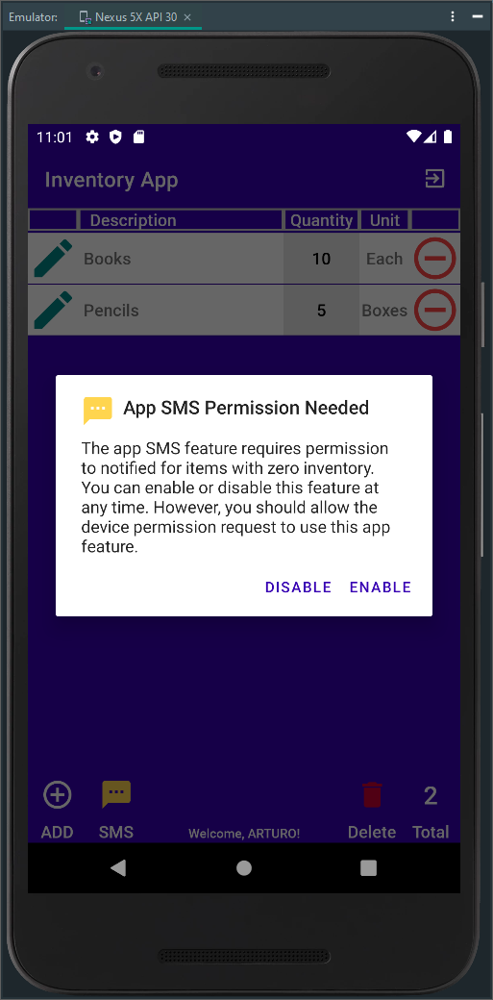
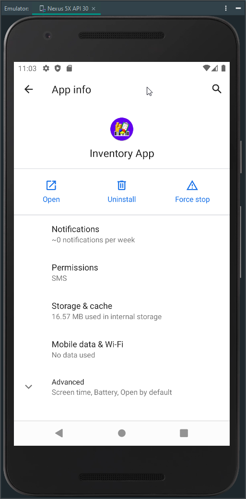

# Inventory App - Android Mobile Application

---

## CS360 Mobile Architect & Programming 21EW6 Refactor September 2021

---

    

> This is the refactor repository of the complete project for SNHU CS360 Mobile Architecture and Programming 21EW6 computer science course. For the original repository visit [SNHU CS360 Mobile Architect and Programming 21EW6 - September 2021 2021](https://www.github.com/arsari/arsari-snhu/tree/master/CS360 "CS360 Mobile Architect and Programming 21EW6")*

## Overview

As a team member of Mobile2App company, we have been hired to assist in developing a mobile application to track items in a warehouse, Inventory App (Option 1). The mobile application project will go through different steps, from planning to design to development, to be ready for launch in the following weeks.

The team takes time to orient themselves to understand the goals and users to target the app. The team meets weekly to discuss the latest client request sent in and assign the work implementing mobile application development principles and best practices in developing a mobile application.

**The Goal:** *The Inventory application is to track items in an inventory list through the primary use of mobile devices. As an example, the track of the items through the app at a warehouse assists in managing and automating the warehouse logistics and accelerating the business's growth and expansion. The app allows the user to fulfill anywhere experience with real-time inventory visibility on any device. The app development is initially based on install for Android Devices.*

To achieve these goal, it has been requested that the mobile application must initially include the following features :

* A database with at least two tables to store: Inventory items, User logins and passwords
* A screen for sign-in or sign-up into the app.
* A grid screen that displays all items in the inventory.
* A mechanism where the user can add and remove items from the inventory.
* A mechanism where the user can increase or decrease the number of specific items in the inventory.
* A mechanism to notify the user when the amount of any item in the inventory has been reduced to zero

Through the design and development of the mobile application, I showcase my skills and abilities in designing software, considering and interpreting the user needs, and implementing them into a program relation of activities in an organized structure. The approach of developing programs that integrate the presentation and layout aspects of the user interface with the programmatic phase of the application.

> [Inventory Mobile App Design Planning Paper](CS360-M3-3_Design.pdf "Inventory Mobile App Design Planning Paper")

As a designer and engineer, I initially plan and program the purpose of my idea and my target audience. Every audience is different, and I should interpret user needs and implement them into the idea to develop by considering their needs in a prioritized way where the most important or favorite features are attended to first. It is like ranking the tasks that need to be incorporated into the app at their initial launch. The importance of looking for competitive apps and how they approach the application's design to resolve the UI/UX for the app and how similar features to our idea were presented and determined by those apps. So, searching in the app store or the internet to find similar apps to the app idea we want to develop is a critical approach to implement.

> [Inventory Mobile App Development Paper](CS360-M7-2_Development.pdf "Inventory Mobile App Development Paper")

There's much information on how a mobile application design process should be. Understanding this process is crucial to produce an app of quality and acceptance to our target audience. Doing these alone is impossible, so it is questionable to think we will create a great application ourselves. On the complete app design and development process, it is essential to look for help to understand our strengths and weaknesses from initial planning to finalization. To be successful, we need to build a collaborative team that could help us digest and practice mobile app development's good practices. Focus on implementing and relating the design components and the programmatic code to continue finding opportunities to improve and innovate the mobile app to overcome a challenge.

## Reflection

In this artifact, I demonstrated my ability to use well-founded and innovative techniques, skills, and tools in computing practices to implement computer solutions that deliver value based on industry-specific goals. The artifact involved an entire software design and engineering process consisting of design considerations of user experience and user interaction with different screens and actions that the application includes. Ensure an intuitive use of the application and its features through industry-standard icons and symbols and a relational database to store the data created, read, updated, and deleted by users through the operation and use of the application.

I designed and evaluated computing solutions that can solve a given problem using algorithmic principles and computer science practices and standards appropriate to its solution while managing the trade-offs involved in design choices considering the relationship and functionality of the algorithms and data structure between the different classes and methods, and the structure of their layouts and source code. I developed a security mindset that anticipates adversarial exploits in software architecture and designs to expose potential vulnerabilities, mitigate design flaws, and ensure privacy. I enhanced the security of data and resources by implementing engineering practices and techniques for validating input data architecture designed with a security mindset and default denial. 

## Screenshots

    
    
    
    
    
    
    
    
    
    
    

---

 

---

<small>_[Updated April, 2022 by ASR]_</small>
